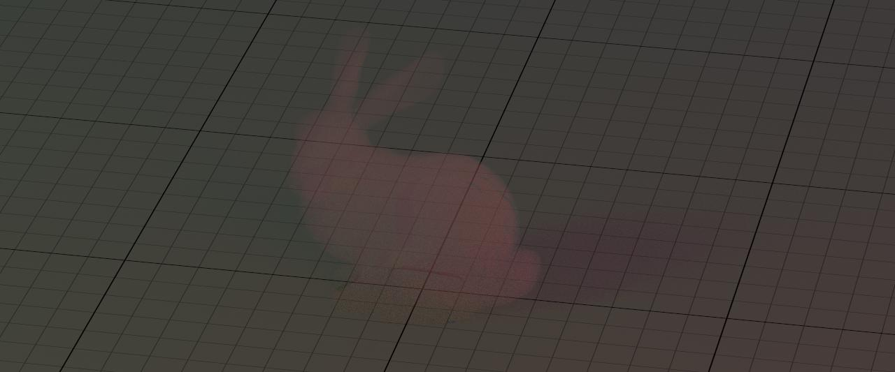
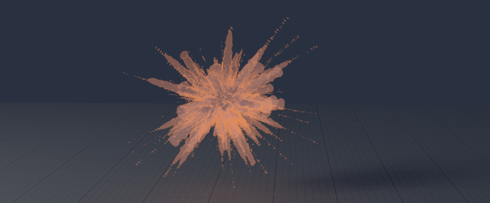
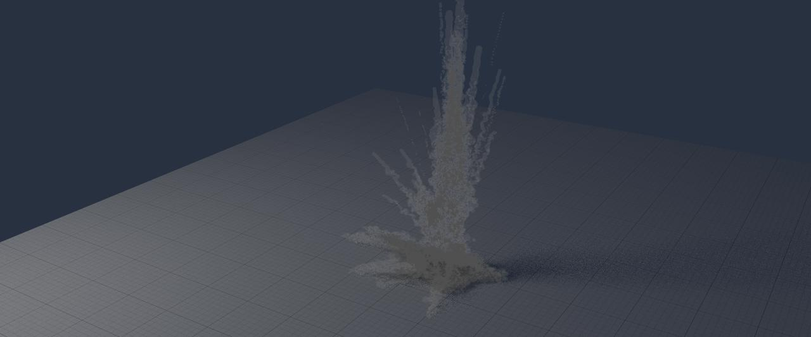
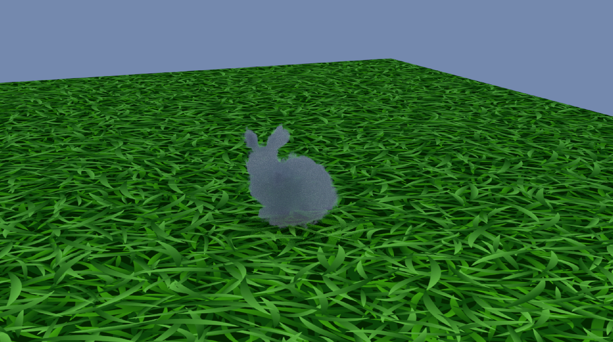
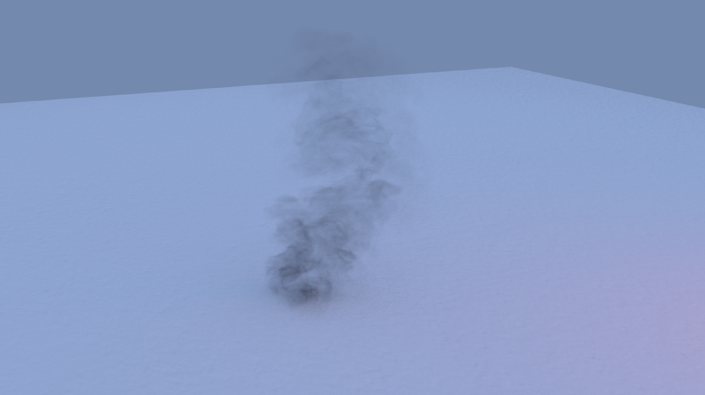
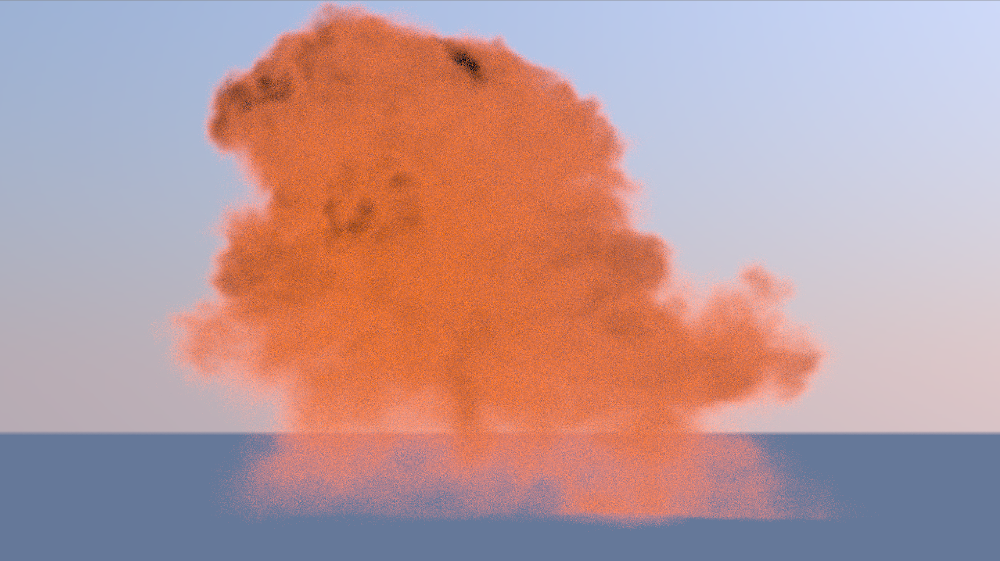

# Null-Scattering Path Integral (NSPI)

## Introduction
The goal of this project is to introduce the heterogeneous volumetric path tracing into the [Yocto/GL](https://xelatihy.github.io/yocto-gl/) Renderer, allowing accurate simulations of complex volumetric phenomena such as smoke and fog.

In order to achieve this, we first found a way to convert the OpenVDB volumetric files into a format compatible with Yocto-GL, then implemented the code to upload them using the JSON scenes and extract the data needed to render the volumetric materials.

## Features
- **Support for Homogeneous and Heterogeneous Volumes**: Enables rendering of volumes with varying densities and attributes.
- **Null-Scattering Path Integral Formulation**: Optimized approach for unbiased estimation in complex participating media.
- **OpenVDB Integration**: Allows the use of volumetric datasets from OpenVDB for realistic rendering.
- **Enhanced Volume Management in Yocto-GL**: Introduces new data structures for handling volumetric data.
- **Volumetric Path Tracing Algorithm**: Implements advanced light transport techniques to simulate realistic interactions of light within media.

## Volumes Handling
Once we extracted the data, we defined a new struct `volume_data` to collect them and modified the already existing `material_point`.

Since the volumetric object might be described by both density values and emission values for each voxel, we implemented some functions to evaluate these properties at a given point, such as: `eval_density`, `eval_emission_nspi`, and `eval_volume`.

### Volume Management in Yocto-GL
- Modified JSON scene format to support volumetric data.
- Implemented new data structures to store volumetric properties, including density, emission, scattering coefficients, and transformations.

## The Algorithm
The last step was the implementation of the actual null-scattering path integral formulation algorithm. We started from one of the path tracers that already implemented the multi-importance sampling (MIS) and added the shading of heterogeneous volumes.

Since in null-scattering algorithms, we can see a heterogeneous volume as a mixture of real and fictitious particles, the main step is keeping track of which type of collision occurs, and we do that using the `eval_medium_interaction` function, as seen in the `trace_path_volume_mis` tracer.

### Volumetric Path Tracing
- **Density and Emission Handling**: Functions to evaluate volumetric properties at given points.
- **Medium Interaction Handling**: Determines scattering, absorption, and null events during light transport.
- **Tracing Algorithm**: Integrates volumetric path tracing with multiple scattering events and Monte Carlo sampling.

## Compilation
This library requires a C++17 compiler and is known to compile on:
- macOS (Xcode >= 11)
- Windows (MSVC >= 2019)
- Linux (gcc >= 9, clang >= 9)

You can build the example applications using CMake with:
```
mkdir build; cd build; cmake ..; cmake --build .
```

Yocto/GL required dependencies are included in the distribution and do not need to be installed separately.

## Run
After building, the program can be run from the command line in the following way:
```
./bin/Debug/ytrace --scene tests_version40/bunny_smoke/smoke.json --output out/lowres/smoke.jpg --samples 4096 --resolution 1280 --sampler volpath --interactive
```

## Results
Several volumetric renderings were achieved using the new system:
- **Volumetric Bunny** (OpenVDB sample) with low-density multiplier.

- **Volumetric Explosion** using converted OpenVDB data.
  
- **Volumetric Airstrike** rendered using OpenVDB volumetric data.
  
- **Cloud Bunny** with high-density multiplier.
  
- **Volumetric Smoke** from OpenVDB sample library.
  
- **Volumetric Eplosion** from OpenVDB sample library.
  

## Conclusion
This project successfully integrates heterogeneous volumetric path tracing into Yocto-GL, enabling realistic rendering of participating media. Future work can focus on optimizing performance and extending support for additional volumetric effects.

## References
1. [Yocto-GL: A Data-Oriented Library for Physically-Based Graphics](https://diglib.eg.org/items/7587e350-9350-4f63-95d2-5420a5037351)
2. [Null-Scattering Path Integral Formulation of Light Transport](https://dl.acm.org/doi/10.1145/3306346.3323025)
3. [VDB: High-Resolution Sparse Volumes with Dynamic Topology](https://dl.acm.org/doi/10.1145/2487228.2487235)

